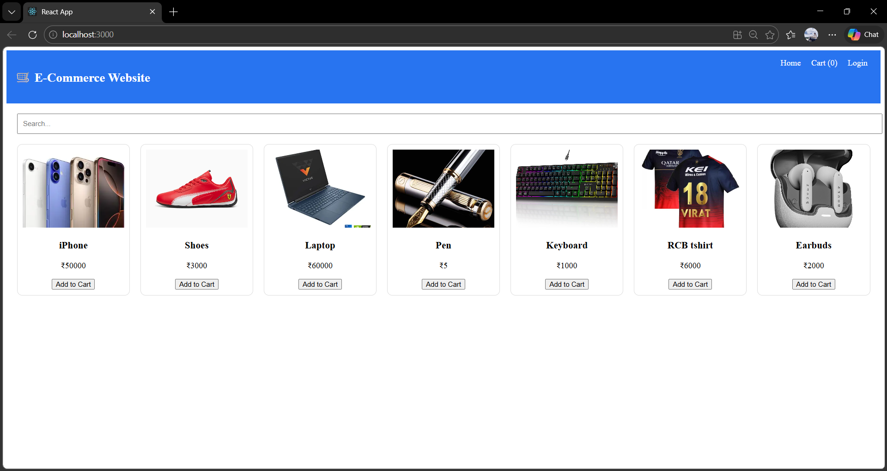

# 🛒 E-Commerce Website (React Project)

A modern, responsive **E-Commerce Web Application** built using React.
Users can browse products, search items, add to cart, and simulate checkout — all with a clean UI inspired by Flipkart.

---

## 🚀 Live Demo

🔗 https://your-site-link.netlify.app

---

## 📸 Preview



---

## ✨ Features

* 🛍️ Browse products with images
* 🔍 Search & filter products
* 🛒 Add to cart / Remove from cart
* 💰 Real-time total price calculation
* 📱 Fully responsive design
* 🔐 Login page UI (frontend only)
* 💳 Dummy checkout system

---

## 🧰 Tech Stack

* React
* Tailwind CSS
* React Router

---

## 📁 Project Structure

```
src/
│
├── components/
│   ├── Navbar.js
│   ├── ProductCard.js
│
├── pages/
│   ├── Home.js
│   ├── CartPage.js
│   ├── Login.js
│
├── App.js
└── index.js
```

---

## ⚙️ Installation & Setup

1. Clone the repository

```
git clone https://github.com/your-username/ecommerce-project.git
```

2. Navigate to project folder

```
cd ecommerce-project
```

3. Install dependencies

```
npm install
```

4. Run the project

```
npm start
```

---

## 🌐 Deployment

Deploy using Netlify or GitHub Pages.

---

## 📌 Note

This project uses static demo data (no backend/database).

---

## 🙌 Author

Kishor C
B.E CSE (AI & ML)

---

